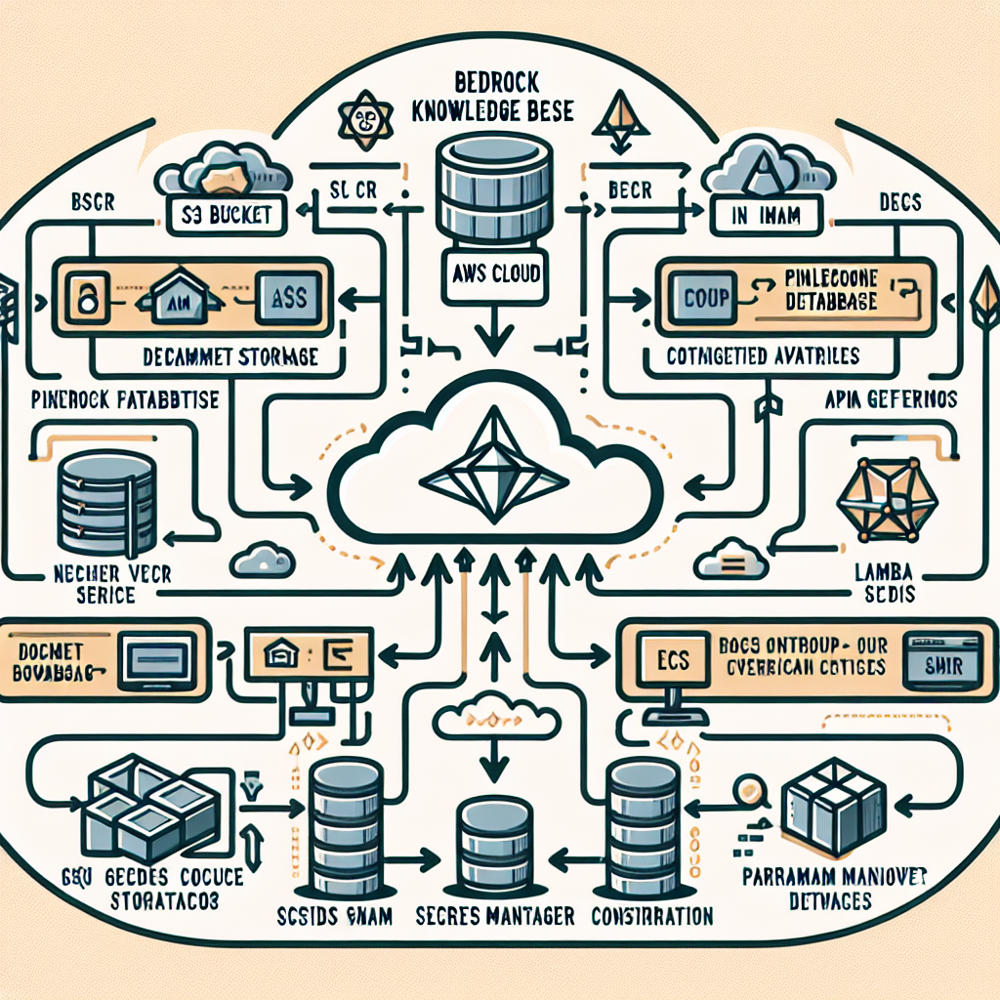

# Bedrock Knowledge Base Project

## Overview

The Bedrock Knowledge Base project is a comprehensive Terraform-based solution for setting up and managing an AWS Bedrock agent knowledge base. This project integrates various AWS services and external tools to create a powerful, scalable, and efficient knowledge management system.

## DALL-e Generated Diagram

## Features

- AWS Bedrock Knowledge Base integration
- Pinecone vector database for efficient data storage and retrieval
- S3 bucket for document storage
- Lambda functions for document ingestion and request processing
- IAM role and policy management
- SNS topic for notifications
- GitHub integration for CI/CD
- ECR for Docker image management
- ECS for containerized application deployment
- API Gateway for RESTful API access
- Secrets Manager for secure credential storage
- SSM Parameter Store for configuration management

## Prerequisites

- Terraform v1.0+
- AWS CLI configured with appropriate permissions
- Pinecone API key
- GitHub token (for CI/CD setup)
- Anthropic API key (for AI model access)

## Module Structure

1. `s3`: Manages S3 buckets for document storage
2. `secrets_manager`: Handles secure storage of API keys and credentials
3. `iam`: Configures IAM roles and policies
4. `pinecone_vectorDB`: Sets up Pinecone vector database
5. `bedrock_knowledge_base`: Configures AWS Bedrock Knowledge Base
6. `lambda`: Manages Lambda functions for document ingestion and processing
7. `sns`: Sets up SNS topics for notifications
8. `github`: Configures GitHub repositories and CI/CD
9. `ecr`: Manages ECR repositories for Docker images
10. `ssm_parameter_store`: Stores configuration parameters
11. `ecs`: Sets up ECS cluster and services
12. `api_gateway`: Configures API Gateway for RESTful access

## Setup and Deployment

1. Clone this repository
2. Set up your `terraform.tfvars` file with the required variables
3. Initialize Terraform:
- `terraform init`

4. Plan the deployment:
- `terraform plan`

5. Apply the configuration:
- `terraform apply`

## Configuration

Key variables to configure in your `terraform.tfvars`:

- `region`: AWS region for deployment
- `pinecone_api_key`: Your Pinecone API key
- `pinecone_environment`: Pinecone environment
- `github_token`: GitHub personal access token
- `github_repo_owner`: GitHub repository owner
- `github_repositories`: List of GitHub repositories to integrate
- `anthropic_api_key`: Anthropic API key for AI model access
- `default_email_address`: Email for SNS notifications
- `aws_environment`: Environment tag (e.g., "prod", "dev")

## Usage

After deployment, you can:
- Upload documents to the created S3 bucket
- Use the API Gateway to query the knowledge base
- [Use the web application](https://github.com/PetreVane/Claude-Knowledge-Base-Agent-with-RAG) deployed as ECS container for interacting with the knowledge base:  **UNDER DEVELOPMENT** 
- Check SNS topics for important notifications

## Security

This project uses AWS Secrets Manager and IAM roles to manage secrets and permissions securely. Ensure that you follow AWS best practices for managing access to your resources.

## Contributing

Contributions to this project are welcome. Please fork the repository and submit a pull request with your changes.

## License

This project is licensed under the MIT License - see the [LICENSE](https://github.com/anthropics/anthropic-quickstarts/blob/main/LICENSE) file for details.

